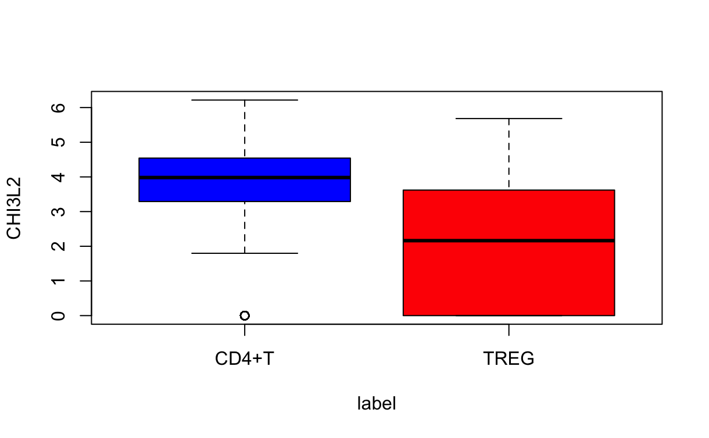

```{r setup, include=FALSE}
knitr::opts_chunk$set(echo = TRUE)
```

# Task 1: Binary Classification

## Abstract Task 1

In the following task the binary classification problem of CD4+T cells and TREG cells is going to be elaborated. We aim in this classification task to identify via various classifiers to predict whether a cell, based on a variety of genes (being features/predictors), is part of the cell type/class/label "CD4+T"-cell or "TREG"-cell. Here we are using a training and test split of 80%/20% to train our classifiers on the given data of n=5471 (n observations, number of cells) and p=4123 (number of genes, predictors). After training and testing the classifiers, we are evaluating them based on given performance metrics which are accuracy, balanced accuracy, AUC and the F1 score. Ultimately, we are trying to improve the given classifiers using PCA, and finally focusing on improving the F1 score by either boosting, hyper-parameter tuning or regularisation of the classifiers. Thus, we are yielding in the end a classifier as our mypredict() function which is going to be used for future binary classification problems of "CD4+T" and "TREG" cells.

## Task 1.1 Data Description

The task_one_df gives us n=5471 cells (classified either as "CD4+T" or as "TREG") and respectively p=4123 genes (features variables) which is expressing the logarithmically normalized RNA expression level for a specific gene. In total we can find 3356 CD4+T cells and 2115 TREG cells in our total dataset. With regards to our problem, we aim to be able to predict whether a cell is a "CD4+T" cell or a "TREG" cell based on the provided features. Therefore it is of interest to find the genes with the most predictive power and information to help us classify the cells. One initial approach with the EDA would be to identify the genes which have the highest absolute difference between the mean of CD4+T cells' expression level and the mean of TREG cells' expression level. This gives intiuitvely the genes which can seperate both cell types the best due to their difference in RNA values. First we can observe how many cells have which absolute mean difference in relation.

```{r echo=FALSE, fig.align='center', out.width="60%"}
knitr::include_graphics("004_443.png")
```

We can see that not all genes have a high amount of information for differentiating between the two cell types CD4+T and TREG and being thus a useful predictor for classification purposes. Rather it is a lower amount of top cells which are able to influence the classification models the most. We will discuss more on this when we talk about PCA and its principal components. In the following we can observe the summary of top 3 cells with the highest absolute difference in mean values, and in addition their boxplots.

|  |  |  |
|------------------------|------------------------|-----------------------|
| {width="200"} | {width="200"} | {width="200"} |

The last plot for the third largest difference in absolute mean values differs from the other since the CD4+T 3rd quarter for TNFRSF1B is still 0 and the mean is located in the 4th quarter and therefore the box plot visually cannot be generated here.

## Task 1.2 Summary Table without PCA

In the following we are evaluating seven different classifiers regarding their classification performance on the given RNA expression data set. First of all, here is a brief overview of each classifier and its classification algorithm:

-   **LDA (Linear Discriminant Analysis)**: The LDA is a dimensionality reduction and uses discriminant functions (linear combinations) within the data and tries to maximize the distance of each class mean and minimize the spread of each class in order to linearly separate each classes from each other in a lower dimensional space.

-   **Log Reg (Logistic Regression)**: The logistic regression uses a sigmoid function to classify the cells where the genes represent the coefficients of the function. The function outputs a value between 0 and 1 and a threshold (typcially 0.5) is used to either classify the cell as a CD4+T or TREG cell.

-   **QDA (Quadratic Discriminant Analysis**): The QDA assumes that each class follows a Gaussian distribution with its own covariance matrix. It works by finding a decision boundary that is quadratic (curved) rather than linear, unlike Linear Discriminant Analysis (LDA). QDA models the class-specific distributions and classifies data by comparing the likelihoods of the data points belonging to each class.

-   **k-NN (k-nearest Neighbor)**: k-NN is a nonoparametric classficiation alogrithm which classifies a data point based on the majority class of its 'k' closest neighbors in the feature space, using a distance metric like Euclidean distance. K-NN makes predictions by examining the local structure of the data, with no explicit training phase, making it highly sensitive to the choice of 'k' and the scale of the features.

-   **GBDT (Gradient Boosted Decision Trees)**: Gradient Boosted Decision Trees (GBDT) are an ensemble learning method that builds a series of decision trees sequentially, where each tree corrects the errors of the previous one. It minimizes a loss function by fitting new trees to the residual errors of the combined model, improving prediction accuracy.

-   **RF (Random Forest)**: The RF uses bootstrapped data sets (random sampling with replacement) and uses this data for decision trees where each node is representing a subset of genes to find the best split. Moreover, multiple decision trees of different structures are made and ultimately aggregated where the majority vote classifies the cell. This makes RF already a bagged (bootstrap aggregated) classifier, allowing to reduce overfitting and improving robustness.

-   **SVM (Support Vector Machine)**: The SVM works by finding a hyperplane that best separates data into different classes, maximizing the margin between the classes. SVM can also handle non-linear data by using kernel functions to transform the data into higher-dimensional spaces.

| w/o PCA  | Accuracy       | Bal. Accuracy  | AUC           | F1            |
|----------|----------------|----------------|---------------|---------------|
| LDA      | 0.9415525      | 0.9406989      | 0.9407        | **0.9525926** |
| Logistic | 0.6392694      | 0.6413256      | 0.6596597     | 0.6857597     |
| QDA      | N/A            | N/A            | N/A           | N/A           |
| k-NN     | 0.7424658      | 0.6963545      | 0.6963545     | 0.5982906     |
| GBDT     | 0.906821       | 0.8856173      | **0.9723815** | 0.9283372     |
| RF       | 0.9351598      | 0.9170923      | 0.9170923     | 0.9500352     |
| SVM      | **0.95525114** | **0.94792398** | 0.94792398    | 0.9394314     |

## Task 1.2 Summary Table with PCA

In the following we are applying the dimensionality reduction tool PCA (Principal Component Analyis). It transforms data into a new coordinate system, where the axes (principal components) capture the maximum variance in the data. It finds a set of orthogonal directions (principal components) that explain the most variability, with the first component explaining the most, the second the second most, and so on. PCA is often used to reduce the number of features while preserving as much information as possible, simplifying data for analysis or visualization.

| with PCA            | Accuracy       | Bal. Accuracy | AUC          | F1            |
|--------------|--------------|--------------|--------------|--------------|
| LDA                 | 0.9360731      | 0.9187735     | **0.989228** | 0.9506347     |
| Logistic            | 0.9488584      | **0.942311**  | 0.942311     | 0.9593023     |
| QDA                 | 0.94063927     | 0.93002086    | 0.98742614   | 0.91864831    |
| k-NN                | 0.91141553     | 0.83837707    | 0.88995297   | 0.87253614    |
| GDBT                | 0.8593607      | 0.8165422     | 0.9576745    | 0.8948426     |
| RF                  | 0.9342466      | 0.9234608     | 0.9234608    | **0.9482014** |
| SVM (Linear Kernel) | 0.94885845     | 0.94183745    | 0.94792398   | 0.93103448    |
| SVM (Radial Kernel) | **0.94977169** | 0.94020409    | 0.94020409   | 0.93133583    |

## Task 1.3 Improved Classifiers

-   Summary Table: of F1 before and F1 after improvement

|                       | F1 Score before | F1 Score after |
|-----------------------|-----------------|----------------|
| QDA/LDA??             |                 |                |
| Logistic (with Ridge) | 0.6857597       |                |
| RF (with AdaBoost)    | 0.9482014       | 0.9628551      |

-   explanation how each classifier was improved and why this improvement method was chosen

## Task 1.4 Final predict function

-   summary and discussion of the results

|             | Accuracy | Bal. Accuracy | AUC | F1 Score |
|-------------|----------|---------------|-----|----------|
| mypredict() |          |               |     |          |

-   present in one row all performance metrics of chosen prediction function
