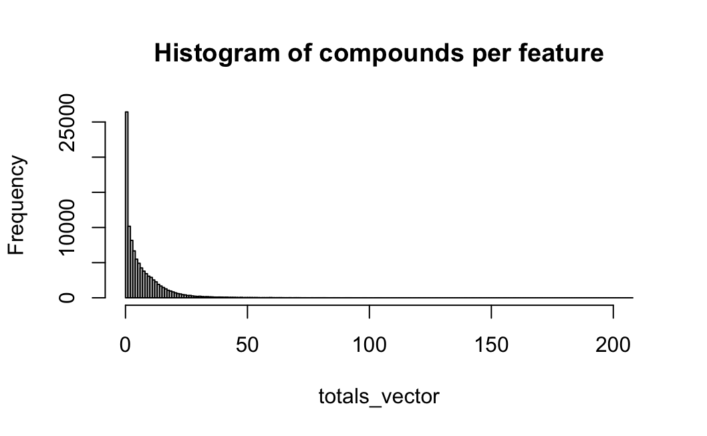
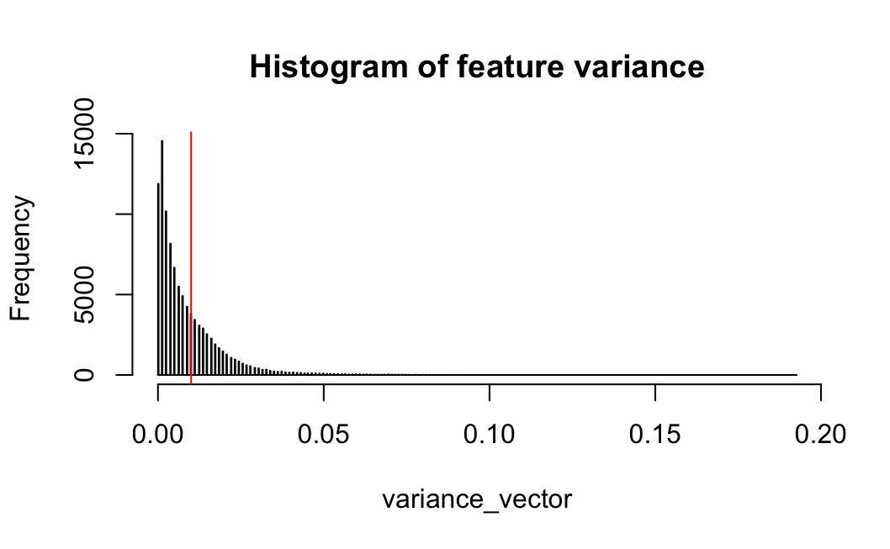
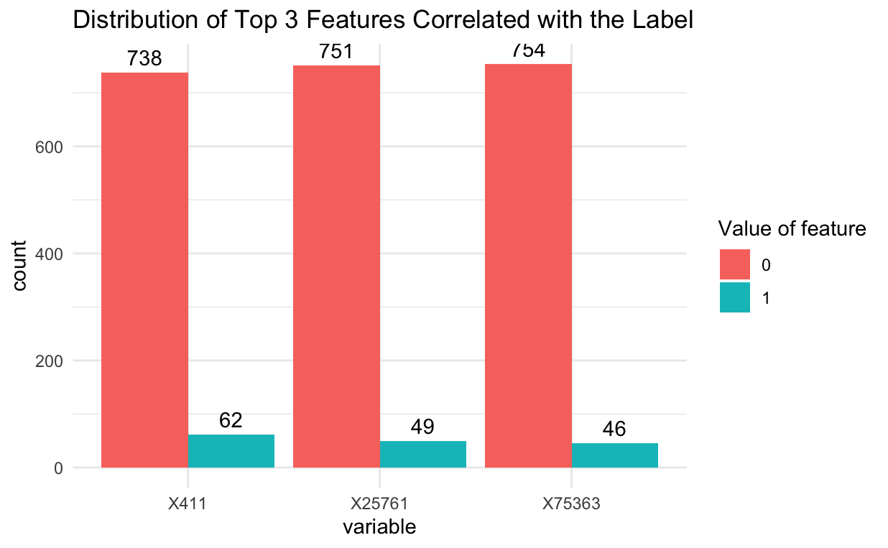
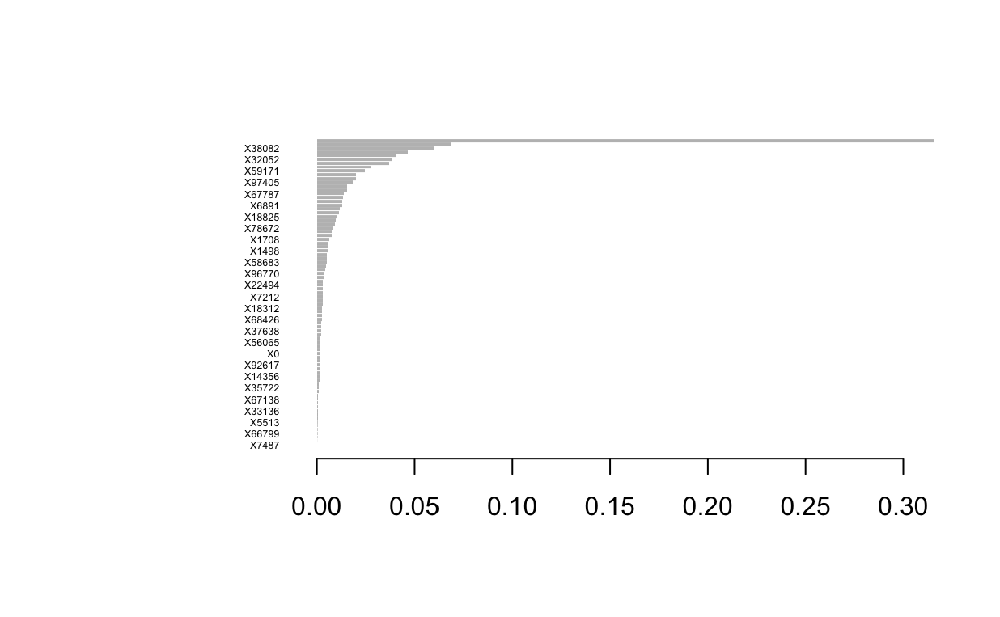

```{r setup, include=FALSE}
knitr::opts_chunk$set(echo = TRUE)
```

# Task 2: Feature Selection

## Abstract Task 2
The focus of the following analysis is to attempt to achieve high classification accuracy, while using a minimal number of features on very highly dimensional data. We used a combination of six different feature selection and classification techniques to accomplish the goal. The models and methods used, were a combination of methods taught in our ST443 Machine Learning and Data Mining Course taught at the London School of Economics and Political Sciences, and other techniques used from personal research. 

## Data Description
We were given one dataset that contains binary features that describe the three-dimensional properties of a molecule in a compound or a random probe across different compounds. The data contains 800 observations, which represent 800 compounds, and 100,000 columns (50,000 real variables and 50,000 random probes). The first column named $label$ represents whether a compound bound to a target site on thrombin^[Thrombin is an enzyme that plays a key role in blood clotting and other biological processes.].

## Exploratory Data Analysis 
Most of our exploratory data analysis was undertaken with the goal of preliminary feature reduction prior to model implementation. After confirming that there were no missing values within our data, we aim to remove features with extremely low to zero variance. The below histograms depict the number of compounds in which a specific feature is present and the variance associated with that given feature respectively. Notice how extremely right skewed both plots are, indicating a high density of features with low variance. Features that contain little to no variance indicate that the molecule property or probe are rarely present in the 800 compounds within our dataset. This means the particular features are not likely to be informative in explaining the $label$ and as such, are not worthwhile to retain. By setting a variance threshold of 0.01, associated with a feature being present in less than or equal to 8 compounds out of 800, we are able to reduce the number of features in the dataset by approximately 2/3, from 100,000 to a little over 30,000. This will greatly speed up the subsequent feature reduction models and hopefully make our results more interpretable. 

```{r, echo=FALSE, out.width="50%"}
par(mfrow = c(2,1))



```

However, even with decreasing our features to 30,000 there are some models that might struggle with the computational cost of training on the dataset. Therefore, we construct an additional subset of the data that solely contains the top 1,000 features that are highly correlated with the $label$. The only feature reduction models that utilize this extremely subset dataset are forward stepwise selection (FSS) and random forest, with the later solely using the subset as a benchmark rather than within the final model. One can assume that if not otherwise specified, any following models use the dataset that contains roughly 30,000 features. Lastly, an important aspect to note is that in terms of classes for the $label$ our data is very skewed with less than 10% (78/800) of the compounds being associated with the positive class (1) which would indicate that the compound bound with the target site. This structure of the data and its implications will be expanded upon later at the conclusion of the report.

```{r, echo=FALSE, out.width="50%", fig.align='center'}

```

## Models
#### Lasso
The first model we attempted to run was logistic classifier with a Lasso-Penalty term. The lasso penalty term is a common regularization technique used for feature selection as it shrinks some of the coefficient estimates to be exactly equal to zero, effectively removing them from the model. The ability to shrink coefficients to zero depends on the magnitude of the tuning parameter, lambda ($\lambda$), which we tune in our model. The best way to choose an optimal $\lambda$ is through cross validation, which we applied in our models. We believed that the lasso coefficient will be most meaningful on a logistic classifier, because our predicted variable was binary which takes values of either 1 or -1 (we convert -1 to 0 for simpler interpretation of probabilities). In our approach, we used a five-fold cross validation, with a grid of 100 different values of $\lambda$. We also used weights to account for the highly imbalanced data.  For each $\lambda$, we calculated the predicted probability where we then decided to classify anything with a probability of 0.5 or more to the "*1*" class else, the "*0*" class. Then using those predictions we calculated the balanced accuracy, and counted the number of selected features for each lambda. Since we wanted to account for best balanced accuracy, and lowest amount of features, we use a scoring formula where *score = balanced accuracy - 0.001***(number of features)*^[Most models had approximatley hundreds of selected features so we believed a penalty of 0.001 was the most appropriate.]. We then extracted the lambda with the best score, trained the data again using that lambda, then tested the model using our test data and reported the number of features selected. The table below shows different results for different predictors, including the model with the worst score, worst balanced accuracy on the cross-validation, the best score:  

|Model            | Lambda Value | Number of Selected Features | Balanced Accuracy |
|-----------------|--------------|-----------------------------|-------------------|
| Worst Score     | 1e-04        | 234                         | 0.8189            |
| Best Score      | 0.0475       | 47                          | 0.8189            |
| Worst BA        | 0.2719       | 1                           | 0.8189            |


#### Forward Stepwise Selection (FSS)
The next model we train is a Forward Stepwise Selection model (FSS). Starting from the null model, FSS trains 'k' models, each containing 0, 1, 2, ..., k features respectively. Each subsequent model includes an additional feature that results in the smallest RSS. From these 'k' models, the "top" model is selected on the basis of some predetermined evaluation criteria such as adjusted r-squared, AIC/BIC, or Cp. This "top" model is defined as the model that returns the maximum value for adjusted r-squared or the minimum value for BIC, which is easily identified due to the concave down and concave up shape for adjusted r-squared and BIC respectively for large enough 'k'. FSS is a relatively straight forward selection model where the only true parameter to decide upon is what evaluation criteria to utilize. With it being rather simplistic, we do not necessarily expect to receive amazing results in regards to the number of features or the resulting balanced accuracy. However, we believe that this will serve as a good to compare for our future models. However, one should note that given the fact that a large 'k' is needed, and each feature is tested to be added to every 1 through k model, FSS can be relatively computationally expensive. In fact, running FSS on the entirety of the data with 30,000 features causes memory storage issues. Therefore, FSS is the only feature selection model that we exclusively train on the subset of the top 1,000 features highly correlated with the $label$. Our results from this subset data when using adjusted r-squared and BIC as the evaluation criteria as shown below. Even though balanced accuracy on the test data is maximized by adjusted r-squared, we decide to proceed with BIC as the evaluation criteria due to it having nearly half of the number of selected features in the final model.

| Evaluation Criteria | Number of Selected Features | Balanced Accuracy |
|---------------------|-----------------------------|-------------------|
| Adjusted R^2        | 383                         | 0.8257            |
| BIC                 | 208                         | 0.7804814         |

#### Random Forest

Originally for random forest we were unable to train the entire dataset of 30,000 features due to memory constraints under the randomForest pacakage. Therefore, similar to FSS, we proceed with only running the random forest on the subset of the top 1,000 features that are most highly correlated with the $label$. After some researching, we found that conducting a random forest with ranger::ranger is much more computationally efficient (https://www.css.cornell.edu/faculty/dgr2/_static/files/R_html/CompareRandomForestPackages.html#4_Conclusion). When we use ranger::ranger we are able to build our random forest on the entirety of the training data (30,000 features). Additionally, when setting the parameter value for the number of trees constant, the ranger package returns far fewer features and a greater balanced accuracy in the final model compared to running random forest with the package randomForest. Note that the balanced accuracy is not that much of a decrease for randomForest. This increases our confidence in the decision to approach computational and memory errors by utilizing the subset dataset in FSS, indicating that likely the subset training data gives us comparably decent results. Note that while we use the subset dataset for random forest in a comparative measure, our final random forest model was trained on the "entirety" of the 30,000 features

| Package      | Initial Data # of Features | Number of Trees | Number of Selected Features | Balanced Accuracy |
|--------------|----------------------------|-----------------|-----------------------------|-------------------|
| randomForest | 1049                       | 5               | 785                         | 0.7974882         |
| ranger       | 30122                      | 5               | 100                         | 0.8223443         |

#### Elastic Net
After the results obtained from the logistic classification method with a lasso penalty term, we thought that it could be interesting to compare with the results of an elastic net. An elastic net is another regularization technique which combines both the Lasso (L1) and the Ridge (L2)^[The Ridge Regularization technique is one that shrinks the coefficients on the predictors, but never to 0, so it keeps all coefficients in a model.] penalties. Since the elastic net penalty is not as harsh as the Lasso penalty, we assumed it will return more features, but we were interested in seeing if the elastic net could improve the balanced accuracy. The elastic net penalty depends on two main parameters, $\lambda$, (the strength of the penalty term) and $\alpha$ (the mix between Lasso and Ridge). We used a process very similar to the one used for the Lasso penalty term on the logistic regression(as in cross-validating and extracting model with the best custom score), only we also tuned for different values of $\alpha$. The table below shows results for the best scores, worst scores, and worst balanced accuracy on the validation set:

| Model           | Alpha Value | Lambda Value | Number of Selected Features | Balanced Accuracy |
|-----------------|-------------|--------------|-----------------------------|-------------------|
| Worst Score     | 0.4         | 0.1205       | 101                         | 0.8257            |
| Best Score      | 0.49        | 0.0955       | 88                          | 0.8608            |
| Worst BA (cv)   | 0.46        | 0.1205       | 75                          | 0.8608            |

#### XGBoost
Boosting is another technique that can be relevant for feature selection. Boosting combines weak learners (usually decision trees) to create a strong learner, and it does so by building models sequentially and attempting to correct the errors made in the previous model. While boosting, the algorithm records the importance of each feature based on how much it improved the model's performance. A boosting algorithm stores an importance score for each feature, and that way some features can be dropped. 
We attempted to use the XGBoost (Extreme Gradient Boosting) algorithm. XGBoost, is a boosting algorithm that is able to handle very large datasets and uses regularization techniques as well. Since XGBoost handles imbalanced data quite well, we decided to not place weights on the data. Our process is similar to the one used for Lasso and the Elastic net, where we loop over certain hyper parameters, most importantly $\lambda$, which represents the shrinkage parameter, specifically the rate which boosting learns. We then returned the model which returned the best balanced accuracy on the cross validation, and then used that model to make predictions on the test data. The number of features selected were extracted from the XGB importance matrix, which calculates importance based on gain, cover and frequency.^[Gain is the improvement in accuracy brought by a feature to the branches it is on. Cover represents the second derivative to the loss function with respect to a variable, a large value means the feature has a large importance on the loss function. Frequency represents the number of times a feature is used in all generated trees.].Features with 0, were excluded from the matrix. Below is a chart for the top 27 features selected for our best XGBoost Model, meaning features with the highest values of importance. We also found that the best learning rate, $\lambda$, was equal to 0.5!

```{r, echo=FALSE, out.width="80%", fig.align="left"}

```

#### Support Vector Machines (SVM)

Our final model involves training a support vector machine. Inherently SVMs do not fall under the umbrella of feature selection or return a value indicating a feature's relative importance, such as what happens under random forest. As such, we undertake an additional method called recursive feature elimination (RFE). RFE involves fitting multiple models with many features, and iteratively removing features of lowest importance until reach a predetermined model size. To begin we once again drop features that appear in our training data with low to zero variance. We set the cutoff to be features that have the positive class appear less than 1%, before scaling and centering our data. Then our primary tuning parameter involves determining how features should remain and models to be compared against one another. We end up testing 47 different models (1, 3, 6, 9, ..., 30, 35, 40, ..., 100, 110, 120, ..., 300, 400, 500, ...1300) and determine that the model with 35 features returns the best accuracy score on the training data, and as such will be the model will utilize for testing.

## Results 

| Model               | Num. of Features   | Bal. Accuracy | Accuracy   | F1           |
|---------------------|--------------------|---------------|------------|--------------|
| Logistic Lasso      | 47                 | 0.8189        | 0.925      | 0.6          |
| FSS                 | 208                | 0.7805        | 0.9188     | 0.5517       |
| Random Forest       | 100                | 0.8223        | 0.9313     | 0.6207       |
| Log. Elastic Net    | 88                 | **0.8608**    | **0.9375** | **0.6667**   |
| XGBoost             | 81                 | 0.8257        | **0.9375** | 0.6429       |
| SVM (Linear Kernel) | **35**             | 0.8574        | 0.9313     | 0.6452       |

## Conclusion
The results above, show us that there is an inherent trade-off between the number of features, and the evaluation metrics such as the balanced accuracy on the test data. The reason we care about taking into consideration the smaller amount of number of features has to do with both efficiency and interpretability. For example, if one were to conduct future research, they could focus on a smaller subset of features. 

It is best to compare the evaluation metrics across different models when they contain relatively similar quantities of features. For instance, when comparing Random Forest, the Elastic Net, and XGBoost, which all have similar quantity of features in their final model, we see that the Elastic Net contains the highest value of balanced accuracy, accuracy, and F1 score out of the three. Similarly, when comparing Logistic Lasso and SVM, the SVM is strickly better across the metrics of balanced accuracy, accuracy, and F1. Depending on one's preferences and goals, either the Elastic Net or the SVM model seem to be good models for the classification for whether a compound will bind to a target site. 

#### Strengths and Weaknesses
Our first attempt at running many of our models, we encountered computational/memory limit-issues. To combat this, we had to aggressively reduce the dimensionality of our data before feature selection from our models could take place. We subset the data based off of features' variance, removing features with less than 0.01 variance. Ideally we would have been able to run the entire original data (100,000 features) through the models and allow them to *naturally* select the relevant features. 

Another difficulty we encountered, was the imbalance of the data. The original dataset had less than 10% of observations that were labeled by the positive class. This could have led to bias in the model towards the more frequently-observed negative class. Measures such as accuracy might be mislead by this bias, and we therefore we used balanced accuracy to evaluate our models instead. 

The strength in our approach is that we employ many different types of feature selection methods. Each one attempts to identify the most important features in different manners. 

#### Future Research
A main goal of future research could be to improve the methods listed above in the hopes of obtaining even stronger results, there are multiple ways we can do this. 1.Ideally, our data would include more compounds (observations) so that there would be more even dimensionality, which would better protect our models from overfitting! 
2. More time, computational power, and lower dimensional data would allow better tuning of the parameters. 3. We could identify features that are highly multicollinear. Failing to remove them,could lead to instability and inefficiency in our models.  

## Refrences
  Guyon, I., Gunn, S., Ben-Hur, A. and Dror, G. (2004) Result Analysis of the NIPS 2003
Feature Selection Challenge. In Advances in Neural Information Processing Systems (Saul,
L., Weiss, Y. and Bottou, L., eds.), vol. 17, MIT Press.

  Shlobin NA, Har-Even M, Itsekson-Hayosh Z, Harnof S, Pick CG. Role of Thrombin in Central Nervous System Injury and Disease. Biomolecules. 2021 Apr 12;11(4):562. doi: 10.3390/biom11040562. PMID: 33921354; PMCID: PMC8070021.
  
  “Understand Your Dataset with Xgboost.” Understand Your Dataset with XGBoost - Xgboost 2.1.3 Documentation, xgboost.readthedocs.io/en/latest/R-package/discoverYourData.html. Accessed 11 Dec. 2024. 
  
 “Variable Importance for Support Vector Machine and Naive Bayes Classifiers in R.” GeeksforGeeks, GeeksforGeeks, 12 July 2024, www.geeksforgeeks.org/variable-importance-for-support-vector-machine-and-naive-bayes-classifiers-in-r/. 
  

  
