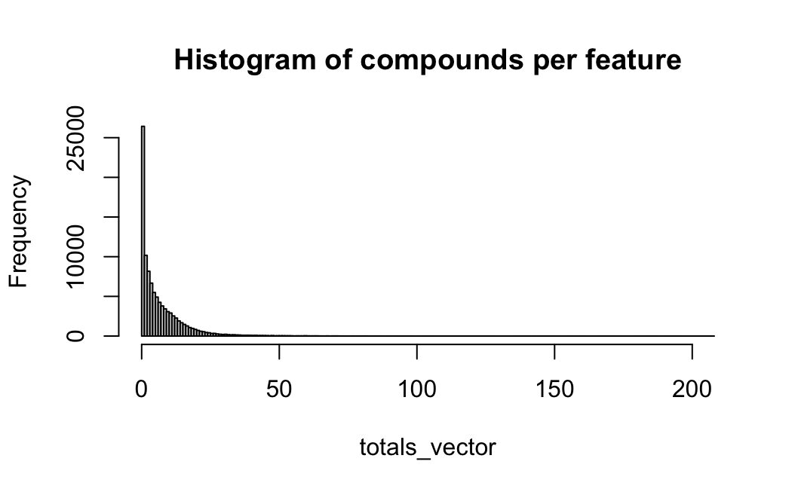
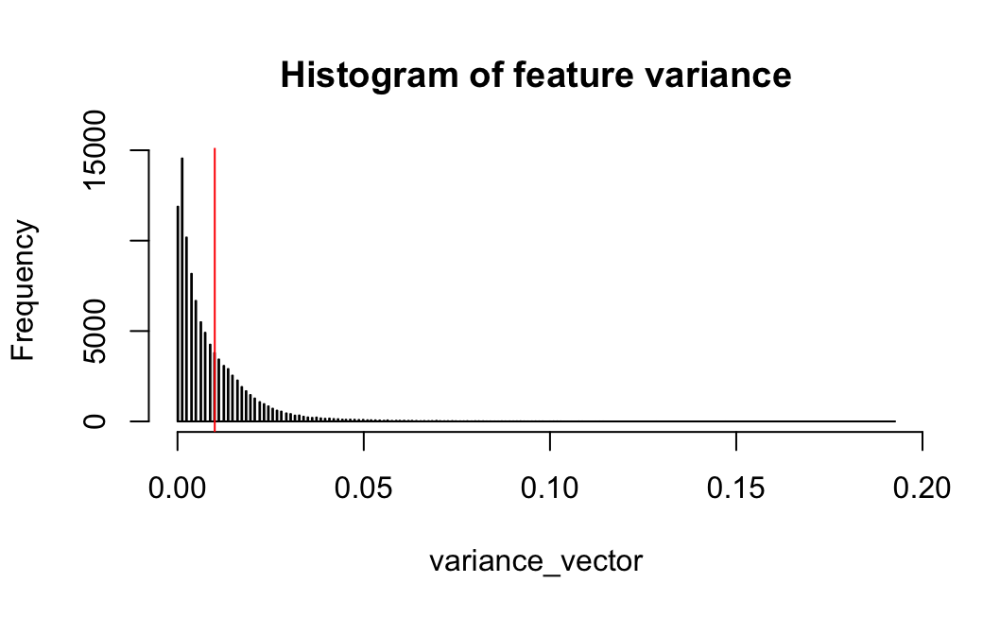
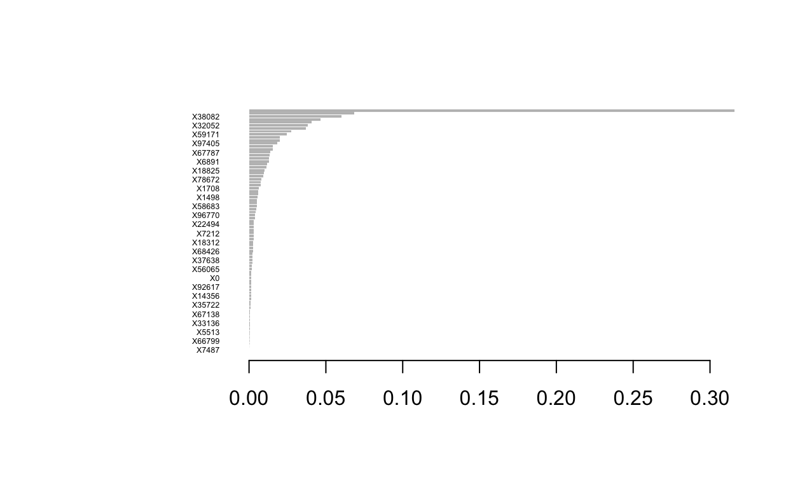

---
output:
  pdf_document: default
  html_document: default
---

```{r setup, include=FALSE}
knitr::opts_chunk$set(echo = TRUE)
```

# Task 1: Binary Classification

## Abstract Task 1

In the following task the binary classification problem of CD4+T cells and TREG cells is going to be elaborated. We aim in this classification task to identify via various classifiers to predict whether a cell, based on a variety of genes (being features/predictors), is part of the cell type/class/label CD4+T-cell or TREG-cell. Here we are using a training and test split of 80%/20% to train our classifiers on the given data of n=5471 (n observations, number of cells) and p=4123 (number of genes, predictors). After training and testing the classifiers, we are evaluating them based on given performance metrics which are accuracy, balanced accuracy, AUC and the F1 score. Ultimately, we are trying to improve the given classifiers using PCA, and finally focusing on improving the F1 score by either boosting, hyper-parameter tuning or regularisation of the classifiers. Thus, we are yielding in the end a classifier as our mypredict() function which is going to be used for future binary classification problems of CD4+T and TREG cells.

## Task 1.1 Data Description

The task_one_df gives us n=5471 cells (classified either as CD4+T or as TREG) and respectively p=4123 genes (features variables) which is expressing the logarithmically normalized RNA expression level for a specific gene. In total we can find 3356 CD4+T cells and 2115 TREG cells in our total dataset. With regards to our problem, we aim to be able to predict whether a cell is a CD4+T cell or a TREG cell based on the provided features. Therefore it is of interest to find the genes with the most predictive power and information to help us classify the cells. One initial approach with the EDA would be to identify the genes which have the highest absolute difference between the mean of CD4+T cells' expression level and the mean of TREG cells' expression level. This gives intiuitvely the genes which can seperate both cell types the best due to their difference in RNA values. First we can observe how many cells have which absolute mean difference in relation.

```{r echo=FALSE, fig.align='center', out.width="30%"}

```

We can see that not all genes have a high amount of information for differentiating between the two cell types CD4+T and TREG and being thus a useful predictor for classification purposes. Rather it is a lower amount of top cells which are able to influence the classification models the most. We will discuss more on this when we talk about PCA and its principal components. In the following we can observe the summary of top 3 cells with the highest absolute difference in mean values, and in addition their boxplots.

+-----------------------------------------+-----------------------------------------+--------------------------------------+
| {width="200"} | {width="200"} | {width="200"} |
+-----------------------------------------+-----------------------------------------+--------------------------------------+

The last plot for the third largest difference in absolute mean values differs from the other since the CD4+T 3rd quarter for TNFRSF1B is still 0 and the mean is located in the 4th quarter and therefore the box plot visually cannot be generated here.

## Task 1.2 Summary Table without PCA

In the following we are evaluating seven different classifiers regarding their classification performance on the given RNA expression data set. First of all, here is a brief overview of each classifier and its classification algorithm:

-   **LDA (Linear Discriminant Analysis)**: The LDA is a dimensionality reduction and uses discriminant functions (linear combinations) within the data and tries to maximize the distance of each class mean and minimize the spread of each class in order to linearly separate each classes from each other in a lower dimensional space.

-   **Log Reg (Logistic Regression)**: The logistic regression uses a sigmoid function to classify the cells where the genes represent the coefficients of the function. The function outputs a value between 0 and 1 and a threshold (typcially 0.5) is used to either classify the cell as a CD4+T or TREG cell.

-   **QDA (Quadratic Discriminant Analysis**): The QDA assumes that each class follows a Gaussian distribution with its own covariance matrix. It works by finding a decision boundary that is quadratic (curved) rather than linear, unlike Linear Discriminant Analysis (LDA). QDA models the class-specific distributions and classifies data by comparing the likelihoods of the data points belonging to each class. The current dimensionality of the data is too high for a QDA classifier. During training, the covariance matrix estimation for each class, k, fails. This occurs because, when the data is partitioned into k classes, the number of observations, n, is much smaller than the number of features, p (i.e n \<\< p). As a result, the covariance matrix estimate for class k becomes singular or nearly singular. Therefore, without dimension reduction or regularisation, training this classifier is not feasible.

-   **k-NN (k-nearest Neighbor)**: k-NN is a nonoparametric classficiation alogrithm which classifies a data point based on the majority class of its 'k' closest neighbors in the feature space, using a distance metric like Euclidean distance. K-NN makes predictions by examining the local structure of the data, with no explicit training phase, making it highly sensitive to the choice of 'k' and the scale of the features.

-   **GBDT (Gradient Boosted Decision Trees)**: Gradient Boosted Decision Trees (GBDT) are an ensemble learning method that builds a series of decision trees sequentially, where each tree corrects the errors of the previous one. It minimizes a loss function by fitting new trees to the residual errors of the combined model, improving prediction accuracy.

-   **RF (Random Forest)**: The RF uses bootstrapped data sets (random sampling with replacement) and uses this data for decision trees where each node is representing a subset of genes to find the best split. Moreover, multiple decision trees of different structures are made and ultimately aggregated where the majority vote classifies the cell. This makes RF already a bagged (bootstrap aggregated) classifier, allowing to reduce overfitting and improving robustness.

-   **SVM (Support Vector Machine)**: The SVM works by finding a hyperplane that best separates data into different classes, maximizing the margin between the classes. SVM can also handle non-linear data by using kernel functions to transform the data into higher-dimensional spaces.

+------------+------------+---------------+------------+------------+
| w/o PCA    | Accuracy   | Bal. Accuracy | AUC        | F1         |
+============+============+===============+============+============+
| LDA        | 0.9416     | 0.9407        | 0.9407     | 0.9238     |
+------------+------------+---------------+------------+------------+
| Logistic   | 0.6393     | 0.6413        | 0.6597     | 0.5766     |
+------------+------------+---------------+------------+------------+
| QDA        | N/A        | N/A           | N/A        | N/A        |
+------------+------------+---------------+------------+------------+
| k-NN       | 0.7425     | 0.6964        | 0.6964     | 0.5983     |
+------------+------------+---------------+------------+------------+
| GBDT       | 0.9087     | 0.8887        | **0.9731** | 0.8698     |
+------------+------------+---------------+------------+------------+
| RF         | 0.9352     | 0.9171        | 0.9171     | 0.9077     |
+------------+------------+---------------+------------+------------+
| SVM        | **0.9553** | **0.9479**    | 0.9479     | **0.9394** |
+------------+------------+---------------+------------+------------+

## Task 1.2 Summary Table with PCA

In the following we are applying the dimensionality reduction tool PCA (Principal Component Analyis). It transforms data into a new coordinate system, where the axes (principal components) capture the maximum variance in the data. It finds a set of orthogonal directions (principal components) that explain the most variability, with the first component explaining the most, the second the second most, and so on. PCA is often used to reduce the number of features while preserving as much information as possible, simplifying data for analysis or visualization. In the following scree plot we can additionally see that approximately ten principal components form the elbow of the scree plot, meaning that ten principal components account for the most Variance within the data set which makes them powerful to use for prediction models.

```{r echo=FALSE, fig.align='center', out.width="30%"}

```

+---------------------+------------+---------------+------------+------------+
| with PCA            | Accuracy   | Bal. Accuracy | AUC        | F1         |
+=====================+============+===============+============+============+
| LDA                 | 0.9352     | 0.9176        | 0.9892     | 0.9079     |
+---------------------+------------+---------------+------------+------------+
| Logistic            | 0.9489     | 0.9414        | **0.9913** | 0.9309     |
+---------------------+------------+---------------+------------+------------+
| QDA                 | 0.9416     | 0.9298        | 0.9876     | 0.9194     |
+---------------------+------------+---------------+------------+------------+
| k-NN                | 0.9187     | 0.8982        | 0.8982     | 0.8834     |
+---------------------+------------+---------------+------------+------------+
| GDBT                | 0.8703     | 0.8394        | 0.9483     | 0.8060     |
+---------------------+------------+---------------+------------+------------+
| RF                  | 0.9379     | 0.9259        | 0.9259     | 0.9144     |
+---------------------+------------+---------------+------------+------------+
| SVM (Linear Kernel) | 0.9489     | **0.9414**    | 0.9414     | 0.9309     |
+---------------------+------------+---------------+------------+------------+
| SVM (Radial Kernel) | **0.9498** | 0.9397        | 0.9397     | **0.9312** |
+---------------------+------------+---------------+------------+------------+

## Task 1.3 Improved Classifiers

Now we want to focus on improving a selection of classifiers with regards to the F1 score. For this exercise we choose to improve two linear classifiers and one more complex one. Hence, we are improving the LDA, Logistic Regression and AdaBoost with given improvement techniques.

+-----------------------------------------+-----------------+----------------+
|                                         | F1 Score before | F1 Score after |
+=========================================+=================+================+
| LDA (with CV and Hyperparameter tuning) | 0.9079          | 0.9487         |
+-----------------------------------------+-----------------+----------------+
| Logistic (with CV and Regularization)   | 0.9309          | 0.9510         |
+-----------------------------------------+-----------------+----------------+
| AdaBoost                                | 0.9289          | 0.9362         |
+-----------------------------------------+-----------------+----------------+

PCA is performed on the data as a means of dimension reduction and scaling. For each of the classifiers, 5-fold cross validations are run on the training data to estimate the F1-Score under different hyperparameters. The main hyperparameters tuned for all classifiers is the number of principal components used in training and the classification threshold. The threshold, in particular, is a key hyperparameter due to its direct impact on the precision and recall of a model. There are other hyperparameters considered and tuned for specific to some of the chosen classifiers.

For a classifier, the set of hyperparameters selected is a set that produces a high average F1-Score from the five folds with a low variance. The classifiers are then trained on the selected number of principal components produced by the training data with the selected set of hyperparameters. Predictions are then made on the principle components of the test set, which are obtained through the same transformation according to the training decomposition. The highest scoring classifier on the test set according to the F1-Score is then the selected classifier for the `mypredict()` function.

The following table shows the hyperparameters considered for each classifier, the range of values cross-validated for and the optimal set chosen.

+---------------------------+---------------------------------+----------------------------------------+--------------+
| Classifier                | Hyperparameters                 | Range Cross-Validated                  | Chosen Set   |
+===========================+=================================+========================================+==============+
| LDA                       | No. Principal Components,\      | $\{10, 11, \ldots, 30\}$,\             | 26,\         |
|                           | Decision Threshold              | $\{0.1, 0.2, \ldots, 0.9\}$\           | 0.2          |
+---------------------------+---------------------------------+----------------------------------------+--------------+
| Logistic Ridge Regression | No. Principal Components,\      | $\{10, 11, \ldots, 30\}$,\             | 48,\         |
|                           | Decision Threshold,\            | $\{0.1, 0.2, \ldots, 0.9\}$,\          | 0.4,\        |
|                           | Regularisation Term ($\lambda$) | $\{0, 0.00001, 0.0001, 0.001, 0.01\}$\ | 0.01         |
+---------------------------+---------------------------------+----------------------------------------+--------------+
| AdaBoost                  | No. Principal Components,\      | $\{15, 16, \ldots, 30\}$,\             | 26,\         |
|                           | Decision Threshold,\            | $\{0.1, 0.2, \ldots, 0.9\}$,\          | 0.5,\        |
|                           | Number of Learners (M),\        | $\{50, 100, 150, 200\}$,\              | 200,\        |
|                           | Depth of Trees                  | $\{3, 5, 7\}$                          | 3            |
+---------------------------+---------------------------------+----------------------------------------+--------------+

The optimal decision thresholds based on the F1-Score varies between classifiers. For the two linear models, the optimal decision boundary is \< 0.5, which could be attributed to the lower proportion of positive labels in the training data (\~3000 CD4+T labels and \~2000 TREG labels). Additionally, for LDA, the optimal threshold is much lower (0.2), which can stem from a violation of the multivariate normal assumption in the PCA space. The larger F1-Score results from lowering the threshold to below 0.5 indicating that the increase in recall is larger than the decrease in precision. AdaBoost's optimal threshold remains close to 0.5 because the boosting algorithm's focus on "harder-to-classify" samples makes it less sensitive to a class imbalance.

It is worth noting that both the Ridge and Lasso regularisation techniques for the Logistic Regression were considered as part of cross-validation. The Lasso showed to be too aggressive even for different values of lambda on the principal components. After 35 components, additional coefficients were sent to 0. The Ridge regularisation provided a less aggressive approach and incorporated an additional increase in the F1-Score after 45 components are trained upon suggesting relationships introduced by such components.

Due to the computational expense of the AdaBoost, the search for optimal number of principal components was limited. Given a more efficient coding of the cross validation and time a wider search for the optimal number of principal components according to the F1-Score could reveal hidden relationships that would benefit classification. 

Ultimately, after comparing the F1 Scores, we are choosing the **Logistic Ridge Regression** to implement into our mypredict() function for Task 1.

If we could extend the analysis and the tuning of the classifiers at hand, we would focus more on the following aspects:

-   **More searches for PCs**: Another improvement step could be to increase the amount of tested principal components to find a better number of principal components. This would help us to find hidden relationships between covariates, especially for the AdaBoost. In the case of AdaBoost we could also even train the model on the whole train data instead of only PCA data.

-   **Tune other hyperparameters**: When looking at the AdaBoost model for decision trees, there are still other hyper parameters to be tuned. In the next step tuning the pruning parameter and the learning rate would be options to optimize the model even more.

-   **10 fold CV**: Due to the restriction in time, a 10-fold CV would have doubled our cross-validation process. Given the opportunity, stepping up from a 5-fold CV to a 10-fold CV would make the model performance estimates more robust and improve the evaluation of models.

-   **Explore LDA's possibilities**: In addition to PCA as a dimension reduction tool, we would explore the use of LDA as a dimension reduction tool that maximises class separability. A logistic classifier can then be built on this new feature space.

# Task 2: Feature Selection

## Abstract Task 2
The focus of the following analysis is to attempt to achieve high classification accuracy, while using a minimal number of features on very highly dimensional data. We used a combination of six different feature selection and classification techniques to accomplish the goal. The models and methods used, were a combination of methods taught in our ST443 Machine Learning and Data Mining Course taught at the London School of Economics and Political Sciences, and other techniques used from personal research. 

## Data Description
We were given one dataset that contains binary features that describe the three-dimensional properties of a molecule in a compound or a random probe across different compounds. The data contains 800 observations, which represent 800 compounds, and 100,000 columns (50,000 real variables and 50,000 random probes). The first column named $label$ represents whether a compound bound to a target site on thrombin^[Thrombin is an enzyme that plays a key role in blood clotting and other biological processes.].

## Exploratory Data Analysis 
Most of our exploratory data analysis was undertaken with the goal of preliminary feature reduction prior to model implementation. After confirming that there were no missing values within our data, we aim to remove features with extremely low to zero variance. The below histograms depict the number of compounds in which a specific feature is present and the variance associated with that given feature respectively. Notice how extremely right skewed both plots are, indicating a high density of features with low variance. Features that contain little to no variance indicate that the molecule property or probe are rarely present in the 800 compounds within our dataset. This means the particular features are not likely to be informative in explaining the $label$ and as such, are not worthwhile to retain. By setting a variance threshold of 0.01, associated with a feature being present in less than or equal to 8 compounds out of 800, we are able to reduce the number of features in the dataset by approximately 2/3, from 100,000 to a little over 30,000. This will greatly speed up the subsequent feature reduction models and hopefully make our results more interpretable. 

```{r, echo=FALSE, out.width="40%"}
par(mfrow = c(2,1))



```

However, even with decreasing our features to 30,000 there are some models that might struggle with the computational cost of training on the dataset. Therefore, we construct an additional subset of the data that solely contains the top 1,000 features that are highly correlated with the $label$. The only feature reduction models that utilize this extremely subset dataset are forward stepwise selection (FSS) and random forest, with the later solely using the subset as a benchmark rather than within the final model. One can assume that if not otherwise specified, any following models use the dataset that contains roughly 30,000 features. Lastly, an important aspect to note is that in terms of classes for the $label$ our data is very skewed with less than 10% (78/800) of the compounds being associated with the positive class (1) which would indicate that the compound bound with the target site. This structure of the data and its implications will be expanded upon later at the conclusion of the report.

```{r, echo=FALSE, out.width="40%", fig.align='center'}
knitr::include_graphics("images/barrchart_eda_2.png")
```

## Models
#### Lasso
The first model we attempted to run was logistic classifier with a Lasso-Penalty term. The lasso penalty term is a common regularization technique used for feature selection as it shrinks some of the coefficient estimates to be exactly equal to zero, effectively removing them from the model. The ability to shrink coefficients to zero depends on the magnitude of the tuning parameter, lambda ($\lambda$), which we tune in our model. The best way to choose an optimal $\lambda$ is through cross validation, which we applied in our models. We believed that the lasso coefficient will be most meaningful on a logistic classifier, because our predicted variable was binary which takes values of either 1 or -1 (we convert -1 to 0 for simpler interpretation of probabilities). In our approach, we used a five-fold cross validation, with a grid of 100 different values of $\lambda$. We also used weights to account for the highly imbalanced data.  For each $\lambda$, we calculated the predicted probability where we then decided to classify anything with a probability of 0.5 or more to the "*1*" class else, the "*0*" class. Then using those predictions we calculated the balanced accuracy, and counted the number of selected features for each lambda. Since we wanted to account for best balanced accuracy, and lowest amount of features, we use a scoring formula where *score = balanced accuracy - 0.001***(number of features)*^[Most models had approximatley hundreds of selected features so we believed a penalty of 0.001 was the most appropriate.]. We then extracted the lambda with the best score, trained the data again using that lambda, then tested the model using our test data and reported the number of features selected. The table below shows different results for different predictors, including the model with the worst score, worst balanced accuracy on the cross-validation, the best score:  

|Model            | Lambda Value | Number of Selected Features | Balanced Accuracy |
|-----------------|--------------|-----------------------------|-------------------|
| Worst Score     | 1e-04        | 234                         | 0.8189            |
| Best Score      | 0.0475       | 47                          | 0.8189            |
| Worst BA        | 0.2719       | 1                           | 0.8189            |


#### Forward Stepwise Selection (FSS)
The next model we train is a forward stepwise selection model (FSS). FSS is a relatively straight forward selection model where the only true parameter to tune is the decision of which evaluation criteria to utilize. With FSS being rather simplistic, we do not expect amazing results in regard to the number of features or the resulting balanced accuracy. However, we believe that the results of FSS will serve as a good benchmark for our future models. One should note that given the large quantity of features in the data, and the fact that each feature is tested to be added to every 1 through k model, FSS can be computationally expensive. In fact, running FSS on the entirety of the data with 30,000 features causes memory storage issues. Therefore, FSS is the only feature selection model that we exclusively train on the subset of the top 1,000 features highly correlated with the $label$. Our results from this subset data when using adjusted r-squared and BIC as the evaluation criteria as shown below. Even though balanced accuracy is maximized by adjusted r-squared, we decide to proceed with BIC as the evaluation criteria due to it having nearly half of the number of selected features.

| Evaluation Criteria | Number of Selected Features | Balanced Accuracy |
|---------------------|-----------------------------|-------------------|
| Adjusted R^2        | 383                         | 0.8257            |
| BIC                 | 208                         | 0.7804814         |

#### Random Forest

Originally for random forest we were unable to train the entire dataset of 30,000 features due to memory constraints under the randomForest pacakage. Therefore, similar to FSS, we proceed with only running the random forest on the subset of the top 1,000 features that are most highly correlated with the $label$. After some research, we found that conducting a random forest with ranger::ranger is much more computationally efficient. When we use ranger::ranger we are able to build our random forest on the entirety of the training data (30,000 features). Additionally, when holding the parameter value for the number of trees constant, the ranger package returns far fewer features and a greater balanced accuracy in the final model compared to the randomForest package. Note that the balanced accuracy is not greatly different between the the dataset with 1,000 and 30,000 features. This increases our confidence in the decision to approach memory constraint errors by utilizing the subset dataset in FSS. Note that while we use the subset dataset for random forest for comparative purposes, our final random forest model was trained on the "entirety" of the 30,000 features

| Package      | Initial Data # of Features | Number of Trees | Number of Selected Features | Balanced Accuracy |
|--------------|----------------------------|-----------------|-----------------------------|-------------------|
| randomForest | 1049                       | 5               | 785                         | 0.7974882         |
| ranger       | 30122                      | 5               | 100                         | 0.8223443         |

#### Elastic Net
After the results obtained from the logistic classification method with a lasso penalty term, we wanted to compare the results of an elastic net. An elastic net is another regularization technique which combines both the Lasso (L1) and the Ridge (L2)^[The Ridge Regularization technique is one that shrinks the coefficients on the predictors, but never to 0, so it keeps all coefficients in a model.] penalties. Since the elastic net penalty is not as harsh as the Lasso penalty, we assumed it will return more features, but we were interested in seeing if the elastic net could improve the balanced accuracy. The elastic net penalty depends on two main parameters, $\lambda$, (the strength of the penalty term) and $\alpha$ (the mix between Lasso and Ridge). We used a process very similar to the one used for the Lasso penalty term on the logistic regression (cross-validating and extracting the model with the best custom score), only we also tuned for different values of $\alpha$. The table below shows results for the best scores, worst scores, and worst balanced accuracy on the cross validation:

| Model           | Alpha Value | Lambda Value | Number of Selected Features | Balanced Accuracy |
|-----------------|-------------|--------------|-----------------------------|-------------------|
| Worst Score     | 0.4         | 0.1205       | 101                         | 0.8257            |
| Best Score      | 0.49        | 0.0955       | 88                          | 0.8608            |
| Worst BA (cv)   | 0.46        | 0.1205       | 75                          | 0.8608            |

#### XGBoost
Boosting is another technique that can be relevant for feature selection. Boosting combines weak learners (usually decision trees) to create a strong learner, and it does so by building models sequentially and attempting to correct the errors made in the previous model. While boosting, the algorithm records the importance of each feature based on how much it improved the model's performance. Boosting stores an importance score for each feature, and that way some features can be dropped from the model, making it useful for feature selection. We attempted to use the XGBoost (Extreme Gradient Boosting) algorithm. XGBoost, is a boosting algorithm that is able to handle very large datasets and uses regularization techniques as well. Since XGBoost handles imbalanced data quite well, we decided to not place weights on the data. Our process is similar to the one used for Lasso and the Elastic net, where we loop over certain hyper parameters, most importantly $\lambda$, which represents the shrinkage parameter, specifically the rate which boosting learns. We then kept the model which returned the best balanced accuracy on the cross validation, and then used that model to make predictions on the test data. The number of features selected were extracted from the XGB importance matrix, which calculates importance based on gain, cover and frequency.^[Gain is the improvement in accuracy brought by a feature to the branches it is on. Cover represents the second derivative to the loss function with respect to a variable, a large value means the feature has a large importance on the loss function. Frequency represents the number of times a feature is used in all generated trees.]. Features with 0, were excluded from the matrix. Below is a chart for the top 27 features selected for our best XGBoost Model, meaning features with the highest values of importance. We also found that the best $\lambda$ was equal to 0.5!
```{r, echo=FALSE, out.width="80%", fig.align="left"}

```

#### Support Vector Machines (SVM)

Our final model involves training a support vector machine. Inherently SVMs do not fall under the umbrella of feature selection or return a value indicating a feature's relative importance, such as what happens under random forest. As such, we undertake an additional method called recursive feature elimination (RFE). RFE involves fitting multiple models with many features, and iteratively removing features of the lowest importance until a predetermined model size is reached. To begin we once again drop features that appear in our training data with low to zero variance. We set the cutoff to be features that have the positive class appear less than 1%, before scaling and centering our data. Then our primary tuning parameter involves determining how many features should remain in the models to be compared against one another. We end up testing 47 different models with the following number of features (1, 3, 6, 9, ..., 30, 35, 40, ..., 100, 110, 120, ..., 300, 400, 500, ...1300) and determine that the model with 35 features returns the best accuracy score on the training data, and as such will be the model will utilize for testing.

## Results 

| Model               | Num. of Features   | Bal. Accuracy | Accuracy   | F1           |
|---------------------|--------------------|---------------|------------|--------------|
| Logistic Lasso      | 47                 | 0.8189        | 0.925      | 0.6          |
| FSS                 | 208                | 0.7805        | 0.9188     | 0.5517       |
| Random Forest       | 100                | 0.8223        | 0.9313     | 0.6207       |
| Log. Elastic Net    | 88                 | **0.8608**    | **0.9375** | **0.6667**   |
| XGBoost             | 81                 | 0.8257        | **0.9375** | 0.6429       |
| SVM (Linear Kernel) | **35**             | 0.8574        | 0.9313     | 0.6452       |

## Conclusion
The results above show us that there is an inherent trade-off between the number of features and the evaluation metrics such as the balanced accuracy on the test data. The reason we care about taking into consideration the smaller amount of number of features has to do with both efficiency and interpretability. For example, if one were to conduct future research, they could focus on a smaller subset of features. 

It is best to compare the evaluation metrics across different models when they contain relatively similar quantities of features. For instance, when comparing Random Forest, the Elastic Net, and XGBoost, which all have similar quantity of features in their final model, we see that the Elastic Net contains the highest value of balanced accuracy, accuracy, and F1 out of the three. Similarly, when comparing Logistic Lasso and SVM, the SVM is strictly better across the metrics of balanced accuracy, accuracy, and F1. Depending on one's preferences and goals, either the Elastic Net or the SVM model seem to be good models for the classification of whether a compound will bind to a target site. 

#### Limitations
Upon our first attempt at running many of our models, we encountered computational/memory limit-issues. To combat this, we had to aggressively reduce the dimensionality of our data before feature selection from our models could take place. We subset the data based off of features' variance, removing features with less than 0.01 variance. Ideally we would have been able to run the entire original data (100,000 features) through the models and allow them to *naturally* select the relevant features. 

Another difficulty we encountered was the imbalance of the data. The original dataset had less than 10% of observations that were labeled by the positive class. This could have led to bias in the model towards the more frequently-observed negative class. Measures such as accuracy might be mislead by this bias, and we therefore used balanced accuracy to evaluate our models instead. 

#### Future Research
A main goal of future research could be to improve the methods listed above in the hopes of obtaining even stronger results. There are multiple ways we can do this. 1) Ideally, our data would include more compounds (observations) so that there would be more even dimensionality, which would better protect our models from overfitting! 
2) More time, computational power, and lower dimensional data would allow better tuning of the parameters. 3) We could identify features that are highly multicollinear. Failing to remove them, could lead to instability and inefficiency in our models.  

## References
  Guyon, I., Gunn, S., Ben-Hur, A. and Dror, G. (2004) Result Analysis of the NIPS 2003
Feature Selection Challenge. In Advances in Neural Information Processing Systems (Saul,
L., Weiss, Y. and Bottou, L., eds.), vol. 17, MIT Press.

  Shlobin NA, Har-Even M, Itsekson-Hayosh Z, Harnof S, Pick CG. Role of Thrombin in Central Nervous System Injury and Disease. Biomolecules. 2021 Apr 12;11(4):562. doi: 10.3390/biom11040562. PMID: 33921354; PMCID: PMC8070021.
  
  “Understand Your Dataset with Xgboost.” Understand Your Dataset with XGBoost - Xgboost 2.1.3 Documentation, xgboost.readthedocs.io/en/latest/R-package/discoverYourData.html. Accessed 11 Dec. 2024. 
  
 “Variable Importance for Support Vector Machine and Naive Bayes Classifiers in R.” GeeksforGeeks, GeeksforGeeks, 12 July 2024, www.geeksforgeeks.org/variable-importance-for-support-vector-machine-and-naive-bayes-classifiers-in-r/. 
  

  

